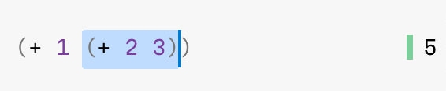
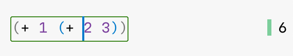
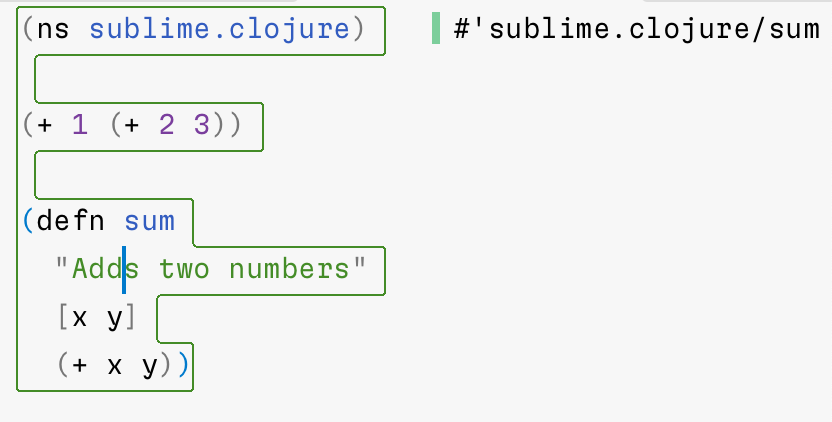
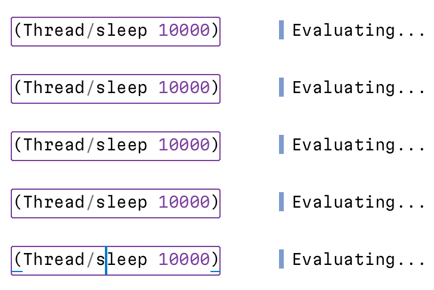
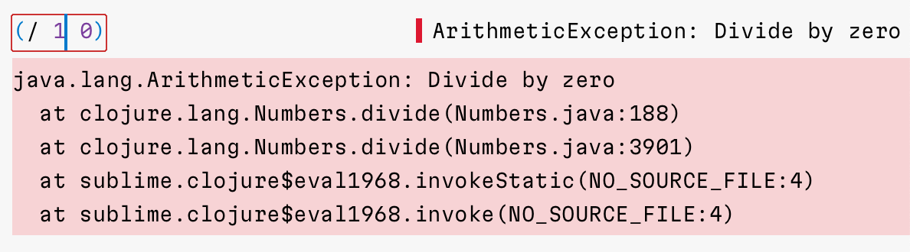
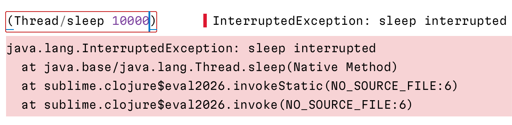
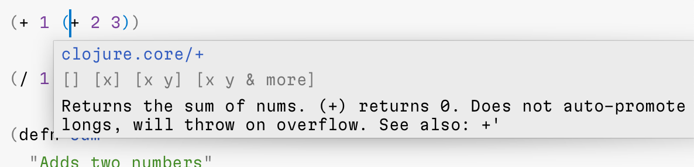

# Clojure support for Sublime Text 4

This package provides Clojure support for Sublime Text and includes:

- Clojure and EDN syntax grammars
- Clojure nREPL client

## Clojure syntax

Unfortunately, Clojure syntax that is shipped with Sublime Text handles many edge cases badly:

Unlike default Clojure syntax, this package is:

- pedantic as per [EDN spec](https://github.com/edn-format/edn) and [Clojure Reader](https://clojure.org/reference/reader),
- rigorously tested,
- detects unbalanced brackets and incorrect escape sequences efficiently,
- punctuation and validation _inside_ regexps.,
- quoted and unquoted regions are marked for highlighting,
- semantically correct tokenization, perfect for fonts with ligatures,
- unicode-friendly (supports unicode letters in symbols/keywords),
- has separate EDN syntax, same way JSON is separate from JavaScript in Sublime Text.

Want to put your parser to test? Check out [syntax_test_edn.edn](./test_syntax/edn.edn) and [syntax_test_clojure.cljc](./test_syntax/clojure.cljc).

## nREPL Client

Sublime Clojure nREPL client enables interactive development from the comfort of your editor.

Principles:

- Minimal distraction. Display evaluation results inline.
- Decomplected. Eval code and nothing more.
- Server-agnostic. We work with any nREPL socket, local or over network.

Features:

- evaluate code,
- display evaluation results inline.
- display stack traces inline,
- interrupt evaluation,
- eval multiple forms at once (parallel evaluation),
- lookup symbol info.

We intentionally excluded following features:

- Autocomplete. Static analysis is much simpler and much more reliable than requiring an always-live connection to the working app.

Why nREPL and not Socket Server REPL/pREPL/unREPL?

- nREPL has the widest adoption,
- nREPL is machine-friendly,
- nREPL comes with batteries included (interrupt, load-file, sideload),
- nREPL is extensible via middleware,
- nREPL serialization is easier to access from Python than EDN.

Differences from [Tutkain](https://tutkain.flowthing.me/):

- nREPL instead of Socket Server REPL
- Does not have separate REPL panel
- Keeps multiple eval results on a screen simultaneously
- Can show stack traces inline in editor
- Can eval several forms in parallel
- Can eval non well-formed forms (e.g. `(+ 1 2`)
- Can eval infinite sequences
- Redirects all `*out*`/`*err*` to `System.out`/`System.err`

## Installation

Intall package:

- `Package Control: Install Package` → `Sublime Clojure`

Assign syntax to Clojure files:

- open any clj/cljc/cljs file,
- run `View` → `Syntax` → `Open all with current extension as...` → `Sublime Clojure` → `Clojure (Sublime Clojure)`.

## How to use

Important! Make sure you switched your syntax to `Clojure (Sublime Clojure)`.

1. Run nREPL server.
2. Run `Sublime Clojure REPL: Connect` command.

From here you have three options:

`Sublime Clojure REPL: Evaluate Selection` evaluates selected text (`Cmd + Enter` in macOS):

`Sublime Clojure REPL: Evaluate Topmost Form` evaluates topmost form around your cursor position (also `Cmd + Enter` in macOS):

`Sublime Clojure REPL: Evaluate Buffer` will evaluate the entire file (`Cmd + Shift + Enter` in macOS):

You don’t have to wait for one form to finish evaluating to evaluate something else. Multiple things can be executed in parallel:

If your evaluation failed, put your cursor inside failed region and run `Sublime Clojure REPL: Toggle Stacktrace` (`Ctrl + E` in macOS):

If your evaluation runs too long and you want to interrupt it, run `Sublime Clojure REPL: Interrupt Pending Evaluations`  (`Ctrl + C` in macOS):

If you want to clear evaluation results, run `Sublime Clojure REPL: Clear Evaluation Results` (`Ctrl + L` in macOS).

Finally, run `Sublime Clojure REPL: Lookup Symbol` when over a symbol to see its documentation (`Ctrl + D` in macOS):

## License

[MIT License](./LICENSE.txt)

## Credits

Made by [Niki Tonsky](https://twitter.com/nikitonsky).
