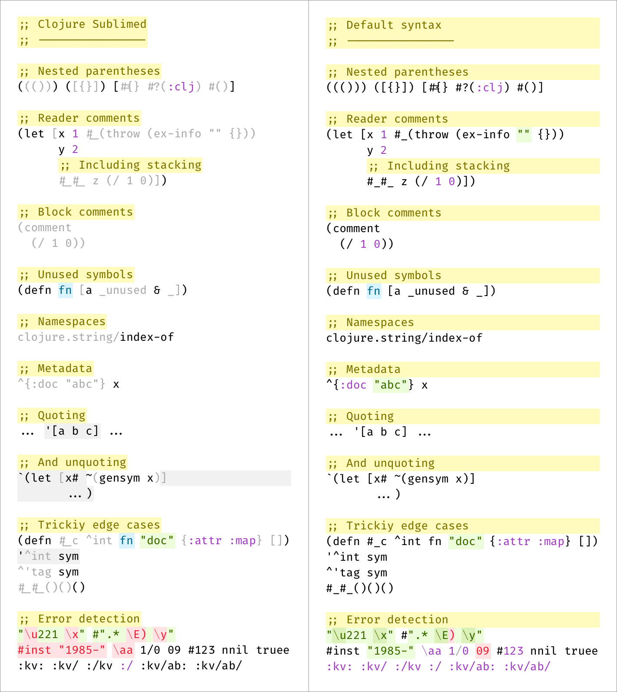

# Clojure support for Sublime Text 4

This package provides Clojure support for Sublime Text and includes:

- Better Clojure and EDN syntax grammars

## Why another Clojure grammar?

Unfortunately, Clojure syntax that is shipped with Sublime Text handles many edge cases badly:

Unlike default Clojure syntax, this package is:

- pedantic as per [EDN spec](https://github.com/edn-format/edn) and [Clojure Reader](https://clojure.org/reference/reader),
- rigorously tested,
- detects unbalanced brackets and incorrect escape sequences efficiently,
- punctuation and validation _inside_ regexps.,
- quoted and unquoted regions are marked for highlighting,
- semantically correct tokenization, perfect for fonts with ligatures,
- unicode-friendly (supports unicode letters in symbols/keywords),
- has separate EDN syntax, same way JSON is separate from JavaScript in Sublime Text.

Want to put your parser to test? Check out [syntax_test_edn.edn](./test/syntax_test_edn.edn) and [syntax_test_clojure.cljc](./test/syntax_test_clojure.cljc).

## Installation

Intall package:

- `Package Control: Install Package` → `Sublime Clojure`

Assign syntax to Clojure files:

- open any clj/cljc/cljs file,
- run `View` → `Syntax` → `Open all with current extension as...` → `Sublime Clojure` → `Clojure (Sublime Clojure)`.

## License

[MIT License](./LICENSE.txt)

## Credits

Made by [Niki Tonsky](https://twitter.com/nikitonsky).
