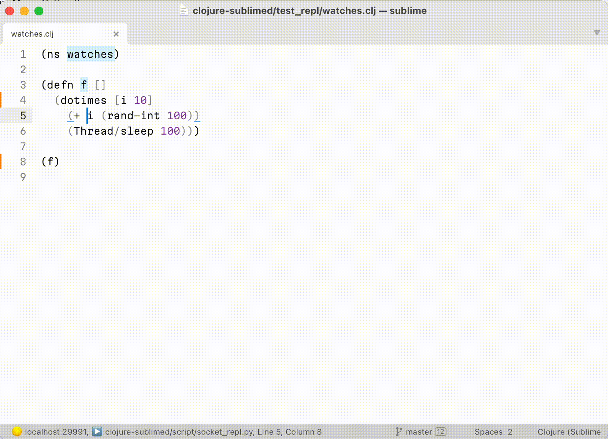
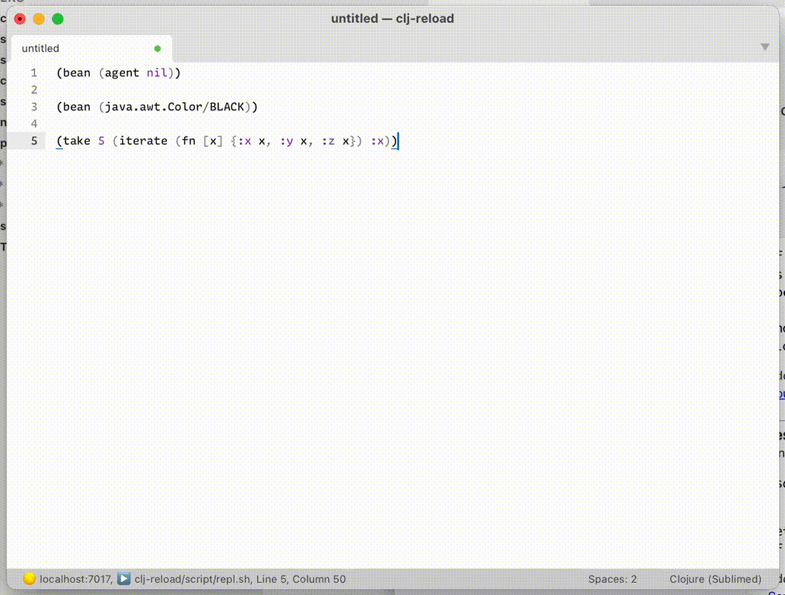
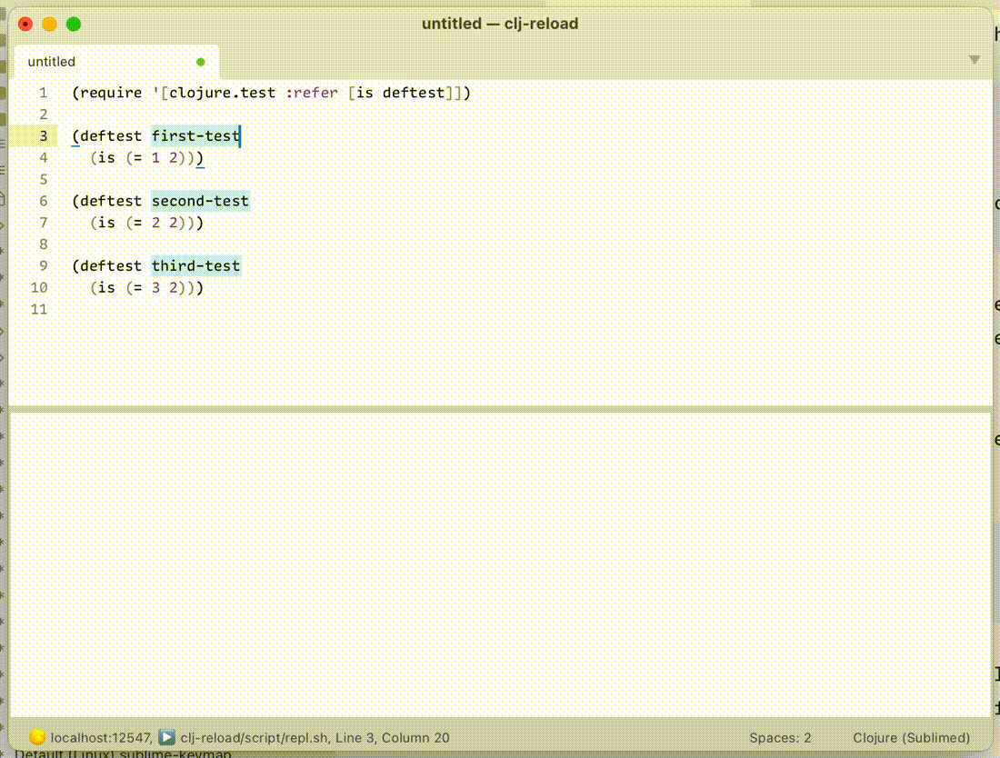

<div align=center></div>

This package provides Clojure support for Sublime Text and includes:

- Clojure syntax
- Color scheme
- Code formatter/indenter
- Clients for nREPL, Socket REPL, ShadowCLJS REPL


# Installation

`Package Control: Install Package` → `Clojure Sublimed`


# Clojure syntax


Clojure Sublimed ships with its own syntax definition for Clojure and EDN. Unlike default Clojure syntax, our syntax can:

- mark reader comments `#_` with the following form, including stacked comments,
- mark `comment` forms,
- mark quoted/unquoted forms,
- mark metadata,
- mark parentheses nesting,
- mark and validate punctuation inside regexps,
- do semantically correct tokenization, perfect for fonts with ligatures,

How to enable? Assign syntax to Clojure files:

For each file type (.clj, .cljs, .cljc, .edn) do:

- Open any file with that extension
- Go to menu -> `View` → `Syntax` → `Open all with current extension as...`
- Select `Clojure (Sublimed)`

Want to put your parser to test? Check out [syntax_test_clojure.cljc](./test_syntax/syntax_test_clojure.cljc).


# Color scheme


To make best use of improved syntax definitions, Clojure Submiled offers its own color scheme:

- Cmd/Ctrl + Shift + P (Command Palette)
- `UI: Select Color Scheme`
- Select `Auto` -> `Clojure Sublimed Light` -> `Clojure Sublimed Dark`

These color schemes will work for other languages, too.


# Formatter/indenter

Clojure Sublimed includes support for both [Better Clojure Formatting](https://tonsky.me/blog/clojurefmt/) and [cljfmt](https://github.com/weavejester/cljfmt/).

Better Clojure Formatting doesn’t require REPL connection, Clojure runtime or external tools. It is enabled by default.

To enable `cljfmt`:

- Download `cljfmt` binary from `https://github.com/weavejester/cljfmt/releases/latest`
- Add `cljfmt` to `$PATH`
- Add `"clojure_sublimed_formatter": "cljfmt"` to `Preferences: Settings`

To reformat whole file, run `Clojure Sublimed: Reindent`. If you have non-empty selection, it will only reformat selected lines.

To enable reindenting/formatting on save, add `"clojure_sublimed_format_on_save": true` to `Preferences: Settings`.

To enable correct indentations as you type code, rebind `Enter` to `Clojure Sublimed: Insert Newline`:

```
{"keys":    ["enter"],
 "command": "clojure_sublimed_insert_newline",
 "context": [{"key": "selector", "operator": "equal", "operand": "source.edn | source.clojure"},
             {"key": "auto_complete_visible", "operator": "equal", "operand": false},
             {"key": "panel_has_focus", "operator": "equal", "operand": false}]}
```

Indent will fix indentation, but will not create new lines. To format a completely unformatted source, use `Pretty-print selection` command:


# Toggle comment command

There are three types of comment in Clojure:

- Line comments `;;` are intended for textual / unstructured comments about code
- Reader discard form `#_` is intended for temporarily disabling parts of code
- `comment` form for coding snippets for future use

By default Sublime will try to use `;;` because it’s most similar to other languages and is simple to implmenet. One can argue, however, that we disable/enable parts of the code way more often that write textual comments about them. Therefore `#_` might work better.

Clojure Sublimed offer `Toggle Comment` command that can be used instead of Sublime provided one in Clojure sources. See Keymap on how to enable.

# Align cursors command

If you select multiple cursors on different lines and run `Align cursors` command, Clojure Sublimed will align them in a column. Works with multiple columns, too:


# REPL clients

Clojure Sublimed REPL clients enable interactive development from the comfort of your editor.

Principles:

- Minimal distraction. Display evaluation results inline.
- Decomplected. Eval code and nothing more.

Features:

- [x] evaluate code,
- [x] display evaluation results inline.
- [x] display stack traces inline,
- [x] interrupt evaluation,
- [x] eval multiple forms at once (parallel evaluation),
- [x] lookup symbol info,
- [x] show evaluation time,
- [x] bind keys to eval arbitrary code.

Clojure Sublimed has four REPL clients:

1. Raw nREPL: no extra middlewares, could work with any nREPL server.
2. JVM nREPL: only works with JVM server.
3. ShadowCLJS nREPL: works with ShadowCLJS
4. JVM Socket REPL: works with raw Socket REPL on JVM

All four support same basic features (eval, lookup, interrupt on JVM), maybe with slightly different quality of implementation.

How to choose which REPL to use?

1. Are you on JVM? Use Socket REPL.
2. On JVM and only have nREPL? Use JVM nREPL.
3. CLJS? Use ShadowCLJS REPL.
4. Otherwise (e.g. babashka, sci, ...) use Raw nREPL.

We intentionally excluded following features:

- [ ] Autocomplete. Static analysis is much simpler and much more reliable than requiring an always-live connection to the working app.

Look at [Sublime LSP](https://github.com/sublimelsp/LSP) with [Clojure LSP](https://github.com/clojure-lsp/clojure-lsp) or [SublimeLinter](https://github.com/SublimeLinter/SublimeLinter) with [clj-kondo](https://github.com/ToxicFrog/SublimeLinter-contrib-clj-kondo) if you need autocompletion.


# How to use

Clojure Sublimed will not run your app for you. Use any other way, e.g.:

- Separate terminal app
- Terminus plugin
- Sublime Executor plugin

For Clojure apps:

1. Run Socket Server, e.g. with either

```sh
clj -X clojure.core.server/start-server :name repl :port 5555 :accept clojure.core.server/repl :server-daemon false
```

or

```sh
clj "-J-Dclojure.server.repl={:port 5555 :accept clojure.core.server/repl :server-daemon false}"
```

2. Run `Clojure Sublimed: Connect to Socket REPL` command.

For Shadow-cljs apps:

1. Run `shadow-cljs watch app`. (This starts a HTTP server and an nREPL)
2. If you are building a web-app, open the http-server url (from step 1) in the browser. This connects the shadow server to JS runtime.
3. Run `Clojure Sublimed: Connect shadow-cljs` command.

For other nREPL apps:

1. Run nREPL server.
2. Run `Clojure Sublimed: Connect to raw nREPL` command.


## Evaluating code from buffer

From here you have three options:

`Clojure Sublimed: Evaluate` without selection evaluates topmost form around your cursor:


`Clojure Sublimed: Evaluate` with selection evaluates selected text:


`Clojure Sublimed: Evaluate Buffer` will evaluate the entire file:


You don’t have to wait for one form to finish evaluating to evaluate something else. Multiple things can be executed in parallel:


By default, Clojure Sublimed will also print evaluation time if it takes more than 100 ms:


## Copying evaluation results

Sometimes you want to copy evaluation result. It is recommended to rebind `Cmd+C`/`Ctrl+C` from `copy` to `sublime_clojure_copy`. This will copy evaluation result if inside evaluated region and fallback to default `copy` otherwise.


## Interrupting

If your evaluation runs too long and you want to interrupt it, run `Clojure Sublimed: Interrupt Pending Evaluations`:


## Opening stacktrace

If your evaluation failed, put your cursor inside failed region and run `Clojure Sublimed: Toggle Stacktrace`:


Clojure Sublimed will display stacktraces in a Clojure-friendly way. Compare with the default REPL:


## Watches

Watches are great alternative to debug prints: they allow you to monitor intermediate values during function execution right in the editor.

This is how they work:

- Select a right-hand expression
- Run `Clojure Sublimed: Add Watch` command
- Now every time function is executed, for any reason, watched expressions will display values they evaluate to, in real time.



Watches are only supported in Socket REPL.


## Looking up symbol

To show symbol info, run `Clojure Sublimed: Toggle Symbol Info`:


Universal `Clojure Sublimed: Toggle Info` command acts as either `Toggle Stacktrace` or `Toggle Symbol Info`, depending on context.


## Binding keys to eval custom code

Every project is different, and sometimes it’s convenient to run a piece of code so often you’d want it on a shortcut. It might be a namespace reload, test execution, database reconnect, linter, formatter — possibilities are endless.

To support such use cases, Clojure Sublimed allows you to bind arbitrary piece of code to a keyboard shortcut. Run `Preferences: Clojure Sublimed Key Bindings` and add something like this:

```
{"keys":    ["ctrl+t"],
 "command": "clojure_sublimed_eval_code",
 "args":    {"code": "(clojure.test/run-all-tests)"}}
```

Then, whenever you press <kbd>Ctrl</kbd> + <kbd>T</kbd>, you’ll see the result in the status bar, like this:


Other possible use-cases (select key combinations to your linking):

Only run tests from current namespace:

```
{"keys":    ["ctrl+shift+t"],
 "command": "clojure_sublimed_eval_code",
 "args":    {"code": "(clojure.test/run-all-tests (re-pattern (str *ns*)))"}}
```

Reload code with [clj-reload](https://github.com/tonsky/clj-reload):

```
{"keys":    ["ctrl+r"],
 "command": "clojure_sublimed_eval_code",
 "args":    {"code": "(clj-reload.core/reload)"}}
```


## Transforming code before eval

You can also modify eval to run a transformed version of code under cursor/inside selection.

For example, this will pretty-print result of your evaluation to stdout:

```
{"keys":    ["ctrl+p"],
 "command": "clojure_sublimed_eval",
 "args":    {"transform": "(doto %code clojure.pprint/pprint)"}}
```

`transform` is a format string that takes selected form, formats it according to described rules and then sends resulting code to evaluation.

If you now press `ctrl+p` on a form like `(+ 1 2)`, the actual eval sent to REPL will be:

```
(doto (+ 1 2) clojure.pprint/pprint)
```

Which will pretty-print evaluation result to stdout. This pattern might be useful for large results that don’t fit inline.

We can implement macroexpand this way:

```
{"keys":    ["ctrl+e"],
 "command": "clojure_sublimed_eval",
 "args":    {"transform": "(macroexpand-1 '%code)",
             "expand": true}}
```

Another use-case might be “eval to buffer”:

```
{"keys":    ["ctrl+b"],
 "command": "chain",
 "args":    {
    "commands": [
      ["clojure_sublimed_eval", {"transform": "(with-open [w (clojure.java.io/writer \"/tmp/sublimed_output.edn\")] (doto %code (clojure.pprint/pprint w)))"}],
      ["open_file", {"file": "/tmp/sublimed_output.edn"}]
    ]
 }
}
```

Eval to buffer at work:



Inside `transform` you can also use `%ns` (current ns) and `%symbol` (if selected form is `def`-something, it will be replaced with defined name, otherwise `nil`).

This allows us to implement “run test under cursor”:

```
{"keys":    ["super+shift+t"],
 "command": "clojure_sublimed_eval",
 "args":    {"transform": "(clojure.test/run-test-var #'%symbol)"}}
```

Run test under cursor at work:




## Clearing results

Finally, to clear evaluation results run `Clojure Sublimed: Clear Evaluation Results`.


## Editing settings

To edit settings, run `Preferences: Clojure Sublimed Settings` command.

If you prefer setting settings in main file, you can do so by prepending `"clojure_sublimed_"` to each setting name. E.g.

```
"debug": True,
```

in `Clojure Sublimed.sublime-settings` becomes

```
"clojure_sublimed_debug": True,
```

in `Preferences.sublime-settings`. Settings from `Preferences.sublime-settings` take priority.


## Session-wide settings

It is sometimes desirable to set dynamic Clojure vars for the whole session. To do that, edit `"eval_shared"` setting. For example:

```
"eval_shared": "(do (set! *warn-on-reflection* true) (set! *print-namespace-maps* false))"
```

This will be applied to every evaluation.


# Default Key Bindings

Clojure Sublimed comes with no keybindings enabled by default to guarantee they won’t conflict with any other extension (Sublime Text’s limitation).

This is the recommended keymap:

Command                       | macOS                            | Windows/Linux                                   | Mnemonic
------------------------------|----------------------------------|-------------------------------------------------| -----------------------
Evaluate                      | <kbd>Ctrl</kbd> <kbd>Enter</kbd> | <kbd>Ctrl</kbd> <kbd>Alt</kbd> <kbd>Enter</kbd> |
Evaluate Buffer               | <kbd>Ctrl</kbd> <kbd>B</kbd>     | <kbd>Ctrl</kbd> <kbd>Alt</kbd> <kbd>B</kbd>     | [B]uffer
Interrupt Pending Evaluations | <kbd>Ctrl</kbd> <kbd>C</kbd>     | <kbd>Ctrl</kbd> <kbd>Alt</kbd> <kbd>C</kbd>     | [C]ancel
Toggle Info                   | <kbd>Ctrl</kbd> <kbd>I</kbd>     | <kbd>Ctrl</kbd> <kbd>Alt</kbd> <kbd>I</kbd>     | [I]nfo
Clear Evaluation Results      | <kbd>Ctrl</kbd> <kbd>L</kbd>     | <kbd>Ctrl</kbd> <kbd>Alt</kbd> <kbd>L</kbd>     | c[L]ear
Copy Evaluation Results       | <kbd>Command</kbd> <kbd>C</kbd>  | <kbd>Ctrl</kbd> <kbd>C</kbd>                    | [C]opy
Reindent Lines                | <kbd>Ctrl</kbd> <kbd>F</kbd> | <kbd>Ctrl</kbd> <kbd>Alt</kbd> <kbd>F</kbd> | [F]ormat
Reindent Buffer               | <kbd>Ctrl</kbd> <kbd>Shift</kbd> <kbd>F</kbd> | <kbd>Ctrl</kbd> <kbd>Alt</kbd> <kbd>Shift</kbd> <kbd>F</kbd> | Capital [F]ormat
Toggle Comment                | <kbd>Command</kbd> <kbd>/</kbd> | <kbd>Ctrl</kbd> <kbd>/</kbd> | Comment [/]

To set it up, run `Preferences: Clojure Sublimed Key Bindings` command and copy example keybindings to your local Key Bindings file.

# stdout/stderr

Clojure Sublimed does things a little different when it comes to stdout. Normally REPL would show you all stdout/stderr that originated from your session. I find it confusing, because it doesn’t always work and you have to check two places for output. Moreover, there’s no output panel, so there’s no place to show stdout anyway.

So instead, Clojure Sublimed _does not_ redirect neither stdout nor stderr. Check original console to see what was printed there.


# Frequently Asked Questions

Q: REPL/eval doesn’t work

A: Make sure you are using nREPL 0.9 or later.
A: Also check console (<kbd>Cmd</kbd> <kbd>\`</kbd>) for errors

---

Q: How to connect to [a Babashka REPL](https://book.babashka.org/#repl)?

A: Use Raw nREPL.

# Credits

Made by [Niki Tonsky](https://twitter.com/nikitonsky).

With contributions by [Jaihindh Reddy](https://github.com/jaihindhreddy) and [KgOfHedgehogs](https://github.com/KGOH/).

# See also

[Writer Color Scheme](https://github.com/tonsky/sublime-scheme-writer): A color scheme optimized for long-form writing.

[Alabaster Color Scheme](https://github.com/tonsky/sublime-scheme-alabaster): Minimal color scheme for coding.

[Sublime Profiles](https://github.com/tonsky/sublime-profiles): Profile switcher.

# License

[MIT License](./LICENSE.txt)
